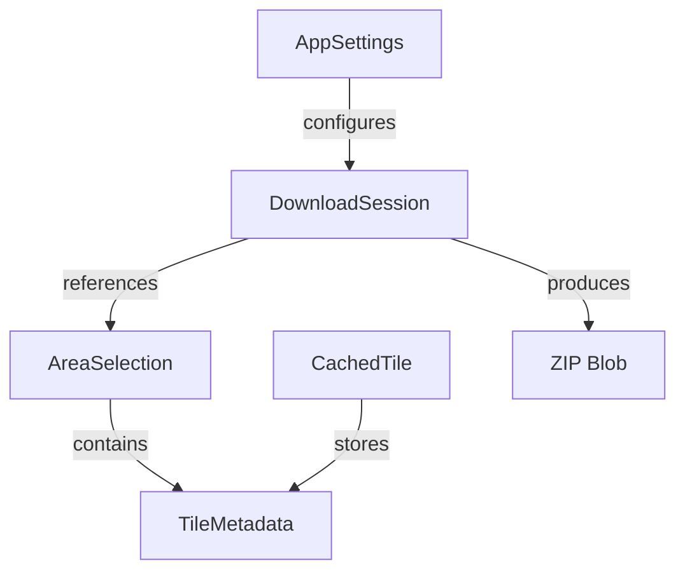

# Data Model: SRTM2TAK PWA

## Overview
The data model for SRTM2TAK is intentionally simple, focusing on tile metadata, user selections, and caching. All data is stored client-side in the browser.

## Core Entities

### 1. TileMetadata
Represents a single SRTM tile's information.

```typescript
interface TileMetadata {
  id: string;           // e.g., "N34W081"
  latitude: number;     // Lower-left corner latitude (34)
  longitude: number;    // Lower-left corner longitude (-81)
  filename: string;     // e.g., "N34W081.hgt"
  url: string;         // Full S3 URL
  sizeCompressed: number;   // Size in bytes (gzipped)
  sizeUncompressed: number; // Size in bytes (raw)
  lastAccessed?: Date;      // For LRU cache eviction
  downloadedAt?: Date;      // When tile was cached
}
```

**Validation Rules**:
- `latitude` must be between -56 and 59
- `longitude` must be between -180 and 179
- `id` must match pattern `/^[NS]\d{2}[EW]\d{3}$/`

### 2. AreaSelection
Represents a user's selected rectangular area on the map.

```typescript
interface AreaSelection {
  id: string;           // UUID for the selection
  bounds: {
    north: number;      // Maximum latitude
    south: number;      // Minimum latitude
    east: number;       // Maximum longitude  
    west: number;       // Minimum longitude
  };
  tiles: string[];      // Array of tile IDs needed
  createdAt: Date;
  estimatedSize: number; // Total uncompressed size in bytes
}
```

**Validation Rules**:
- `north` must be > `south`
- `east` must be > `west` (accounting for antimeridian)
- `bounds` must be within SRTM coverage area
- Maximum 100 tiles per selection (safety limit)

### 3. CachedTile
Represents a downloaded and stored SRTM tile.

```typescript
interface CachedTile {
  id: string;           // Same as TileMetadata.id
  data: ArrayBuffer;    // Uncompressed HGT data
  metadata: TileMetadata;
  cachedAt: Date;
  accessCount: number;  // For cache optimization
  size: number;         // Size in bytes
}
```

**Validation Rules**:
- `data` must be exactly 25,934,402 bytes (3601 * 3601 * 2)
- `id` must exist in TileMetadata

### 4. DownloadSession
Tracks a download operation for user feedback.

```typescript
interface DownloadSession {
  id: string;           // UUID
  selection: AreaSelection;
  status: 'pending' | 'downloading' | 'processing' | 'complete' | 'error';
  progress: {
    tilesTotal: number;
    tilesDownloaded: number;
    bytesTotal: number;
    bytesDownloaded: number;
  };
  startedAt: Date;
  completedAt?: Date;
  error?: string;
  zipBlob?: Blob;       // Final ZIP file
}
```

**State Transitions**:
- `pending` → `downloading` → `processing` → `complete`
- Any state → `error` (on failure)

### 5. AppSettings
User preferences and app configuration.

```typescript
interface AppSettings {
  maxCacheSize: number;      // Maximum cache in bytes (default: 2GB)
  concurrentDownloads: number; // Max parallel downloads (default: 3)
  retryAttempts: number;      // Network retry count (default: 3)
  mapProvider: 'osm' | 'cartodb' | 'esri';
  theme: 'light' | 'dark' | 'auto';
  showTileGrid: boolean;      // Overlay SRTM grid on map
  autoZipDownload: boolean;   // Auto-download when complete
}
```

## Storage Schema

### IndexedDB Structure

```javascript
// Database: srtm2tak
// Version: 1

// Object Stores:
const stores = {
  'tiles': {          // Cached tile data
    keyPath: 'id',
    indexes: [
      { name: 'lastAccessed', keyPath: 'lastAccessed' },
      { name: 'size', keyPath: 'size' }
    ]
  },
  'selections': {     // User area selections
    keyPath: 'id',
    indexes: [
      { name: 'createdAt', keyPath: 'createdAt' }
    ]
  },
  'sessions': {       // Download sessions
    keyPath: 'id',
    indexes: [
      { name: 'status', keyPath: 'status' },
      { name: 'startedAt', keyPath: 'startedAt' }
    ]
  }
};
```

### LocalStorage Keys

```javascript
const localStorageKeys = {
  'srtm2tak:settings': AppSettings,      // JSON stringified
  'srtm2tak:last-selection': string,     // Selection ID
  'srtm2tak:install-dismissed': boolean, // PWA install prompt
  'srtm2tak:version': string            // App version for migrations
};
```

## Data Relationships



## Calculated Fields

### TileMetadata Calculations
```javascript
// Calculate tile ID from coordinates
function getTileId(lat, lon) {
  const latPrefix = lat >= 0 ? 'N' : 'S';
  const lonPrefix = lon >= 0 ? 'E' : 'W';
  const latStr = Math.abs(Math.floor(lat)).toString().padStart(2, '0');
  const lonStr = Math.abs(Math.floor(lon)).toString().padStart(3, '0');
  return `${latPrefix}${latStr}${lonPrefix}${lonStr}`;
}

// Calculate S3 URL
function getTileUrl(tileId) {
  const dir = tileId.substring(0, 3); // e.g., "N34"
  return `https://s3.amazonaws.com/elevation-tiles-prod/skadi/${dir}/${tileId}.hgt.gz`;
}
```

### AreaSelection Calculations
```javascript
// Calculate required tiles for bounds
function getTilesForBounds(bounds) {
  const tiles = [];
  for (let lat = Math.floor(bounds.south); lat < Math.ceil(bounds.north); lat++) {
    for (let lon = Math.floor(bounds.west); lon < Math.ceil(bounds.east); lon++) {
      tiles.push(getTileId(lat, lon));
    }
  }
  return tiles;
}
```

## Cache Management

### LRU Eviction Policy
```javascript
// When cache exceeds maxCacheSize
async function evictLRU(requiredSpace) {
  const tiles = await db.getAllFromIndex('tiles', 'lastAccessed');
  let freedSpace = 0;
  for (const tile of tiles) {
    if (freedSpace >= requiredSpace) break;
    await db.delete('tiles', tile.id);
    freedSpace += tile.size;
  }
}
```

### Storage Quota Check
```javascript
// Check available storage before download
async function checkStorageQuota() {
  if ('storage' in navigator && 'estimate' in navigator.storage) {
    const {usage, quota} = await navigator.storage.estimate();
    return {
      used: usage,
      available: quota - usage,
      percentage: (usage / quota) * 100
    };
  }
  return null; // Fallback to unlimited
}
```

## Data Validation

### Coordinate Validation
```javascript
function validateCoordinates(lat, lon) {
  // Check SRTM coverage
  if (lat < -56 || lat > 60) return false;
  if (lon < -180 || lon > 180) return false;
  
  // Check for ocean tiles (simplified)
  // Real implementation would use a coverage map
  return true;
}
```

### Selection Validation
```javascript
function validateSelection(bounds) {
  const tiles = getTilesForBounds(bounds);
  
  // Check tile count limit
  if (tiles.length > 100) {
    throw new Error('Selection too large (max 100 tiles)');
  }
  
  // Check estimated size
  const estimatedSize = tiles.length * 25934402;
  if (estimatedSize > 2 * 1024 * 1024 * 1024) {
    throw new Error('Selection would exceed 2GB');
  }
  
  return true;
}
```

## Migration Strategy

For future schema changes:

```javascript
async function migrateDatabase(oldVersion, newVersion) {
  if (oldVersion < 1 && newVersion >= 1) {
    // Initial schema creation
  }
  if (oldVersion < 2 && newVersion >= 2) {
    // Future migration example
    // Add new indexes, transform data, etc.
  }
}
```