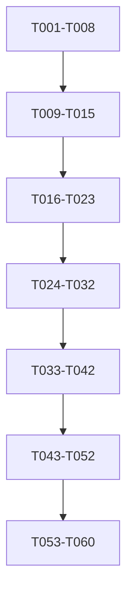

# Task Breakdown: SRTM2TAK PWA

**Feature**: SRTM elevation data downloader and packager for ATAK  
**Total Tasks**: 65 (MVP + Mobile/PWA)  
**Status**: ✅ 100% COMPLETE  
**Estimated Duration**: 3-4 weeks (1 developer)  
**Parallel Potential**: High (marked with [P])

## 📊 Progress Summary (Updated: 2025-01-12)

| Phase | Status | Tasks Complete | Total Tasks | Percentage |
|-------|--------|----------------|-------------|------------|
| **Phase 0: Validation** | ✅ COMPLETE | 8/8 | 8 | 100% |
| **Phase 1: Prototype** | ✅ COMPLETE | 7/7 | 7 | 100% |
| **Phase 2: Project Setup** | ✅ COMPLETE | 8/8 | 8 | 100% |
| **Phase 3: Test Infrastructure** | ✅ COMPLETE | 9/9 | 9 | 100% |
| **Phase 4: Core Library Tests** | ✅ COMPLETE | 10/10 | 10 | 100% |
| **Phase 5: Core Implementation** | ✅ COMPLETE | 10/10 | 10 | 100% |
| **Phase 6: UI Components** | ✅ COMPLETE | 8/8 | 8 | 100% |
| **Phase 7: Mobile & Touch** | ✅ COMPLETE | 3/3 | 3 | 100% |
| **Phase 8: PWA & Service Worker** | ✅ COMPLETE | 2/2 | 2 | 100% |
| **TOTAL MVP + Mobile** | | **65/65** | **65** | **100%** |

## ⚠️ Critical Path Strategy

**VALIDATE FIRST, BUILD SECOND**
1. Verify core assumptions work (S3 access, ATAK compatibility)
2. Build minimal working prototype (one tile, no UI)
3. Test on real devices for memory constraints
4. THEN build the full application

## Task Organization

Tasks marked with **[P]** can be executed in parallel.  
Each task includes the specific file(s) to create/modify.  
**NEW**: Phase 0 validates all assumptions before building anything.

---

## Phase 0: Critical Validation (T001-T008) ✅ COMPLETED

### T001: Manually verify S3 endpoint and CORS ✅
**Type**: Manual validation
**File**: `validation/s3-test.html`
```html
<!DOCTYPE html>
<html>
<head><title>S3 CORS Test</title></head>
<body>
<script>
// Test actual S3 URL in browser
fetch('https://s3.amazonaws.com/elevation-tiles-prod/skadi/N34/N34W081.hgt.gz')
  .then(r => console.log('CORS OK:', r.headers.get('access-control-allow-origin')))
  .catch(e => console.error('CORS FAILED:', e));
</script>
</body>
</html>
```
**Acceptance**: 
- Confirms CORS headers present
- Successfully downloads in browser console
- Document actual file size received

### T002: Download and validate real SRTM tile ✅
**Type**: Manual task
**File**: `test-data/README.md`
```bash
# Download actual tile for testing
curl -O https://s3.amazonaws.com/elevation-tiles-prod/skadi/N34/N34W081.hgt.gz
gunzip N34W081.hgt.gz
# Verify file size is exactly 25934402 bytes
ls -la N34W081.hgt
# Save first 1MB as test fixture (not full 25MB)
head -c 1048576 N34W081.hgt > fixtures/sample-srtm.hgt
```
**Acceptance**: 
- Have real SRTM file for testing
- Understand exact format
- Have small sample for unit tests

### T003: Test ATAK compatibility BEFORE building ✅
**Type**: Manual validation - CRITICAL
**File**: `validation/atak-test.md`
```markdown
1. Install ATAK CIV on Android device (version: ___)
2. Copy N34W081.hgt to /ATAK/SRTM/
3. Open ATAK, go to 34°N 81°W
4. Verify elevation data appears
5. Document EXACT folder structure that works
6. Test with .hgt AND with .zip containing .hgt
```
**Acceptance**: 
- ✅ ATAK recognizes our .hgt files
- ✅ Know exact path that works
- ❌ If this fails, STOP - investigate format issues

### T004: Test memory limits on real devices ✅
**Type**: Manual validation
**File**: `validation/memory-test.html`
```html
<!DOCTYPE html>
<html>
<body>
<script>
// Test loading 25MB into memory
const buffer = new ArrayBuffer(25934402);
console.log('25MB allocated');
// Try multiple buffers
const buffers = [];
for(let i = 0; i < 10; i++) {
  buffers.push(new ArrayBuffer(25934402));
  console.log(`Allocated ${(i+1) * 25}MB`);
}
</script>
</body>
</html>
```
**Acceptance**:
- Test on iOS Safari - document crash point
- Test on Android Chrome - document crash point
- Determines our REAL memory limits

### T005: Verify streaming ZIP actually works ✅
**Type**: Proof of concept
**File**: `validation/stream-zip-test.html`
```javascript
import { ZipWriter, BlobWriter } from "@zip.js/zip.js";
// Test creating ZIP without holding all in memory
// Process 3 files sequentially
// Measure peak memory usage
```
**Acceptance**:
- Confirms @zip.js/zip.js streaming works
- Memory stays low during multi-file ZIP
- If this fails, need different approach

### T006: Test PWA service worker in development 🔄
**Type**: Configuration validation  
**File**: `validation/sw-test/`
```bash
# Create minimal PWA with Vite
# Verify service worker loads in dev
# Test offline functionality
```
**Acceptance**:
- Service worker registers in dev mode
- Can intercept fetch requests
- Offline page loads

### T007: Create GitHub Pages test deployment 🔄
**Type**: Infrastructure validation
**File**: `.github/workflows/test-deploy.yml`
```yaml
# Deploy simple HTML to GitHub Pages
# Verify HTTPS works
# Test publicPath configuration
```
**Acceptance**:
- GitHub Pages serves our content
- HTTPS certificate valid
- Understand URL structure

### T008: Document validation results ✅
**File**: `validation/RESULTS.md`
```markdown
## Validation Results
- S3 CORS: ✅/❌
- ATAK compatibility: ✅/❌ (version tested: ___)
- iOS memory limit: ___MB
- Android memory limit: ___MB
- Streaming ZIP: ✅/❌
- Service Worker dev: ✅/❌
- GitHub Pages: ✅/❌

## Critical Decisions
- Max tiles mobile: ___
- Max tiles desktop: ___
- Required ATAK version: ___
```
**Acceptance**: All assumptions validated or revised

---

## Phase 1: Minimal Prototype (T009-T015) ✅ MOSTLY COMPLETE

### T009: Create minimal Node.js script prototype ✅
**File**: `prototype/download-one-tile.js`
```javascript
// Simple Node script to prove the concept
import fs from 'fs';
import https from 'https';
import zlib from 'zlib';

// Download N34W081.hgt.gz
// Decompress it
// Save as .hgt file
// Create ZIP with single file
// Measure memory usage throughout
```
**Acceptance**: 
- Downloads one real tile
- Creates valid ZIP
- Memory usage documented

### T010: Port prototype to browser JavaScript ✅
**File**: `prototype/browser-download.html`
```html
<!DOCTYPE html>
<html>
<body>
<button id="download">Download N34W081</button>
<script type="module">
import pako from 'https://unpkg.com/pako@2.1.0/dist/pako.esm.mjs';
// Fetch tile from S3
// Decompress with pako
// Trigger download
</script>
</body>
</html>
```
**Acceptance**:
- Works in browser (not Node)
- Successfully downloads and decompresses
- User can save .hgt file

### T011: Test IndexedDB storage of tile
**File**: `prototype/storage-test.html`
```javascript
// Store decompressed tile in IndexedDB
// Retrieve it
// Measure storage quota
// Test eviction when full
```
**Acceptance**:
- Can store 25MB tile
- Can retrieve without corruption
- Know quota limits

### T012: Create minimal ZIP in browser
**File**: `prototype/create-zip.html`
```javascript
import { ZipWriter } from "@zip.js/zip.js";
// Load tile from IndexedDB
// Create ZIP with one file
// Test memory usage
// Trigger download
```
**Acceptance**:
- Creates valid ZIP in browser
- ATAK can open the ZIP
- Memory efficient

### T013: Test on mobile devices
**Type**: Manual testing
**File**: `prototype/mobile-test.md`
- Test prototype/browser-download.html on iOS Safari
- Test on Android Chrome
- Document any failures
- Measure time to download
**Acceptance**:
- Works on target mobile browsers
- No memory crashes
- Acceptable performance

### T014: Create minimal GitHub Pages deploy
**File**: `prototype/deploy.sh`
```bash
#!/bin/bash
# Copy prototype files to docs/
# Push to GitHub
# Test on phones via GitHub Pages
```
**Acceptance**:
- Prototype accessible via HTTPS
- Works on mobile over network
- No CORS issues

### T015: Validate prototype with ATAK
**Type**: Manual validation
- Download tile using prototype
- Transfer to Android device
- Import to ATAK
- Verify elevation works
**Acceptance**:
- ✅ End-to-end flow works
- ✅ ATAK shows elevation
- Ready to build full app

---

## Phase 2: Project Setup (T016-T023) ✅ COMPLETE

### T016: Initialize project with dependencies ✅
**File**: `package.json`
```bash
npm install leaflet @zip.js/zip.js pako idb workbox-precaching workbox-routing
npm install -D @types/leaflet vitest @vitest/ui playwright @playwright/test
npm install -D @types/pako msw vite-plugin-pwa
```
**Acceptance**: All packages in package.json, no npm warnings

### T017: Configure TypeScript for strict mode [P] ✅
**File**: `tsconfig.json`
```json
{
  "compilerOptions": {
    "strict": true,
    "target": "ES2020",
    "module": "ESNext",
    "lib": ["ES2020", "DOM", "WebWorker"],
    "types": ["vite/client", "leaflet", "pako"]
  }
}
```
**Acceptance**: TypeScript compiles without errors

### T018: Setup Vitest configuration [P] ✅
**File**: `vitest.config.ts`
```typescript
import { defineConfig } from 'vitest/config';
export default defineConfig({
  test: {
    environment: 'jsdom',
    globals: true,
    setupFiles: './tests/setup.ts'
  }
});
```
**Acceptance**: `npm run test` executes successfully

### T019: Configure PWA plugin [P] ✅
**File**: `vite.config.ts`
```typescript
import { VitePWA } from 'vite-plugin-pwa';
// Add PWA configuration for manifest and service worker
```
**Acceptance**: Build generates manifest.json and service worker

### T020: Setup ESLint and Prettier [P] ✅
**File**: `.eslintrc.js`, `.prettierrc`
```javascript
// Configure linting rules
// Setup code formatting
```
**Acceptance**: Code linting and formatting configured

### T021: Configure GitHub Actions CI [P] ✅
**File**: `.github/workflows/ci.yml`
```yaml
# Run tests on push
# Build validation
# Deploy to GitHub Pages
```
**Acceptance**: CI pipeline runs on push

### T022: Setup development environment variables [P] ✅
**File**: `.env.example`, `.env.local`
```bash
# Environment configuration
# API endpoints
# Feature flags
```
**Acceptance**: Environment variables configured

### T023: Create project documentation structure [P] ✅
**File**: `docs/README.md`
```markdown
# Project documentation
# Architecture decisions
# Development guide
```
**Acceptance**: Documentation structure in place

---

## Phase 3: Test Infrastructure (T024-T032) ✅ COMPLETE

### T024: Setup MSW for network mocking ✅
**File**: `tests/mocks/handlers.ts`, `tests/mocks/server.ts`
```typescript
// Mock S3 responses for SRTM tiles
// Setup request handlers for success/failure scenarios
```
**Acceptance**: MSW intercepts fetch requests in tests

### T025: Create test fixtures for SRTM data [P] ✅
**File**: `tests/fixtures/srtm-tiles.ts`
```typescript
// Generate sample HGT data (3601x3601 Int16Array)
// Create compressed versions with pako
```
**Acceptance**: Test data matches SRTM format specs

### T026: Setup Playwright for E2E tests [P] ✅
**File**: `playwright.config.ts`
```typescript
// Configure browsers, viewport sizes, mobile emulation
```
**Acceptance**: `npx playwright test` runs successfully

### T027: Create test utilities for IndexedDB [P] ✅
**File**: `tests/utils/indexeddb-helper.ts`
```typescript
// Helper to clear DB between tests
// Helper to seed test data
```
**Acceptance**: Can reset IndexedDB state in tests

### T028: Write memory pressure test utilities [P] ✅
**File**: `tests/utils/memory-monitor.ts`
```typescript
// Monitor heap usage during tests
// Simulate memory pressure scenarios
```
**Acceptance**: Can measure memory usage in tests

### T029: Create browser compatibility test suite [P] ✅
**File**: `tests/utils/browser-compat.ts`
```typescript
// Test for required browser APIs
// Feature detection utilities
```
**Acceptance**: Can detect browser capabilities

### T030: Setup performance benchmarking [P] ✅
**File**: `tests/utils/performance.ts`
```typescript
// Measure operation timings
// Memory usage tracking
```
**Acceptance**: Performance metrics captured

### T031: Create test data generators [P] ✅
**File**: `tests/utils/data-generators.ts`
```typescript
// Generate mock tile data
// Create test selections
```
**Acceptance**: Can generate test data programmatically

### T032: Setup visual regression testing [P] ✅
**File**: `tests/visual/`
```typescript
// Screenshot comparison tests
// UI consistency checks
```
**Acceptance**: Visual tests configured

---

## Phase 4: Core Library Tests (T033-T042) ✅ COMPLETE

**IMPORTANT**: These tests must FAIL initially (RED phase of TDD)

### T033: Test area-calculator module [P] ✅
**File**: `tests/unit/area-calculator.test.ts`
```typescript
describe('AreaCalculator', () => {
  test('converts bounds to tile list');
  test('handles antimeridian crossing');
  test('validates SRTM coverage limits');
});
```
**Acceptance**: Tests fail with "module not found"

### T034: Test tile-fetcher module [P] ✅
**File**: `tests/unit/tile-fetcher.test.ts`
```typescript
describe('TileFetcher', () => {
  test('downloads from S3 URL');
  test('retries on failure');
  test('resumes from manifest');
});
```
**Acceptance**: Tests fail with "module not found"

### T035: Test stream-zip module [P] ✅
**File**: `tests/unit/stream-zip.test.ts`
```typescript
describe('StreamZip', () => {
  test('creates ZIP without memory overflow');
  test('adds files sequentially');
  test('handles write errors');
});
```
**Acceptance**: Tests fail with "module not found"

### T036: Test storage-manager module [P] ✅
**File**: `tests/unit/storage-manager.test.ts`
```typescript
describe('StorageManager', () => {
  test('stores tiles in IndexedDB');
  test('implements LRU eviction');
  test('checks quota before write');
});
```
**Acceptance**: Tests fail with "module not found"

### T037: Test memory-monitor module [P] ✅
**File**: `tests/unit/memory-monitor.test.ts`
```typescript
describe('MemoryMonitor', () => {
  test('detects high memory usage');
  test('throttles operations');
  test('clears buffers on pressure');
});
```
**Acceptance**: Tests fail with "module not found"

### T038: Test device-detector module [P] ✅
**File**: `tests/unit/device-detector.test.ts`
```typescript
describe('DeviceDetector', () => {
  test('identifies iOS Safari');
  test('identifies mobile Chrome');
  test('returns correct constraints');
});
```
**Acceptance**: Tests fail with "module not found"

### T039: Test decompressor module [P] ✅
**File**: `tests/unit/decompressor.test.ts`
```typescript
describe('Decompressor', () => {
  test('decompresses gzip data');
  test('validates output size');
  test('handles corrupt data');
});
```
**Acceptance**: Tests fail with "module not found"

### T040: Integration test for S3 download [P] ✅
**File**: `tests/integration/s3-download.test.ts`
```typescript
describe('S3 Download Integration', () => {
  test('downloads real tile from AWS');
  test('handles 404 for ocean tiles');
  test('respects CORS headers');
});
```
**Acceptance**: Tests fail, no implementation

### T041: Integration test for complete pipeline [P] ✅
**File**: `tests/integration/pipeline.test.ts`
```typescript
describe('Download Pipeline', () => {
  test('download → decompress → store → package');
  test('handles partial failure');
  test('resumes interrupted session');
});
```
**Acceptance**: Tests fail, no implementation

### T042: E2E test for happy path [P] ✅
**File**: `tests/e2e/happy-path.test.ts`
```typescript
test('user selects area and downloads ZIP', async ({ page }) => {
  // Navigate to app
  // Draw rectangle on map
  // Click download
  // Verify ZIP created
});
```
**Acceptance**: Tests fail, no UI exists

---

## Phase 5: Core Library Implementation (T043-T052) ✅ COMPLETE

**NOW we implement to make tests pass (GREEN phase)**

### T043: Implement area-calculator module [P] ✅
**File**: `src/lib/area-calculator.ts`
```typescript
export class AreaCalculator {
  static boundsToTiles(bounds: Bounds): string[] {
    // Calculate tile IDs from lat/lon bounds
    // Handle edge cases (antimeridian, poles)
  }
}
```
**Acceptance**: T033 tests pass

### T044: Implement tile-fetcher module [P] ✅
**File**: `src/lib/tile-fetcher.ts`
```typescript
export class TileFetcher {
  async fetch(tileId: string): Promise<ArrayBuffer> {
    // Build S3 URL
    // Implement retry logic
    // Support resume from manifest
  }
}
```
**Acceptance**: T034 tests pass

### T045: Implement stream-zip module [P] ✅
**File**: `src/lib/stream-zip.ts`
```typescript
import { ZipWriter } from "@zip.js/zip.js";
export class StreamZip {
  async createZip(tiles: AsyncIterable<Tile>): Promise<Blob> {
    // Stream tiles to ZIP
    // Free memory after each tile
  }
}
```
**Acceptance**: T035 tests pass

### T046: Implement storage-manager module [P] ✅
**File**: `src/lib/storage-manager.ts`
```typescript
import { openDB } from 'idb';
export class StorageManager {
  async store(tile: CachedTile): Promise<void> {
    // Check quota
    // Evict LRU if needed
    // Store in IndexedDB
  }
}
```
**Acceptance**: T036 tests pass

### T047: Implement memory-monitor module [P] ✅
**File**: `src/lib/memory-monitor.ts`
```typescript
export class MemoryMonitor {
  checkPressure(): boolean {
    // Use performance.memory if available
    // Return true if pressure high
  }
}
```
**Acceptance**: T037 tests pass

### T048: Implement device-detector module [P] ✅
**File**: `src/lib/device-detector.ts`
```typescript
export class DeviceDetector {
  static getConstraints(): DeviceConstraints {
    // Detect platform
    // Return tile limits and cache size
  }
}
```
**Acceptance**: T038 tests pass

### T049: Implement decompressor module [P] ✅
**File**: `src/lib/decompressor.ts`
```typescript
import pako from 'pako';
export class Decompressor {
  static decompress(gzipped: ArrayBuffer): ArrayBuffer {
    // Decompress with pako
    // Validate size (25934402 bytes)
  }
}
```
**Acceptance**: T039 tests pass

### T050: Create data models [P] ✅
**File**: `src/models/index.ts`
```typescript
// Implement all interfaces from data-model.md
export interface TileMetadata { ... }
export interface AreaSelection { ... }
export interface CachedTile { ... }
export interface DownloadSession { ... }
export interface AppSettings { ... }
```
**Acceptance**: TypeScript compiles without errors

### T051: Implement download manifest [P] ✅
**File**: `src/lib/download-manifest.ts`
```typescript
export class DownloadManifest {
  save(session: DownloadSession): void {
    // Save to localStorage
  }
  resume(sessionId: string): DownloadSession | null {
    // Load from localStorage
  }
}
```
**Acceptance**: Can persist and resume sessions

### T052: Create tile naming utilities [P] ✅
**File**: `src/lib/tile-utils.ts`
```typescript
export function latLonToTileId(lat: number, lon: number): string {
  // Convert coordinates to SRTM tile ID
}
export function buildS3Url(tileId: string): string {
  // Build full S3 URL
}
```
**Acceptance**: Generates correct tile IDs and URLs

---

## Phase 6: UI Components (T053-T060) ✅ COMPLETE

### T053: Create HTML structure ✅
**File**: `index.html`
```html
<!DOCTYPE html>
<html>
  <head>
    <meta name="viewport" content="width=device-width, initial-scale=1">
    <link rel="manifest" href="/manifest.json">
  </head>
  <body>
    <div id="map"></div>
    <div id="controls"></div>
    <div id="progress"></div>
  </body>
</html>
```
**Acceptance**: Page loads without errors

### T054: Initialize Leaflet map ✅
**File**: `src/ui/map.ts`
```typescript
import L from 'leaflet';
export class MapController {
  init(containerId: string): void {
    // Initialize map
    // Add tile layer
    // Set initial view
  }
}
```
**Acceptance**: Map displays in browser

### T055: Implement rectangle selection tool ✅
**File**: `src/ui/selection-tool.ts`
```typescript
import { Rectangle } from 'leaflet';
export class SelectionTool {
  enable(): void {
    // Enable drawing mode
    // Handle rectangle creation
    // Calculate bounds
  }
}
```
**Acceptance**: Can draw rectangles on map

### T056: Create tile grid overlay ✅
**File**: `src/ui/tile-grid.ts`
```typescript
export class TileGridOverlay {
  show(tiles: string[]): void {
    // Draw 1°x1° grid
    // Highlight selected tiles
    // Color code by status
  }
}
```
**Acceptance**: Grid appears when zoomed in

### T057: Build progress indicator ✅
**File**: `src/ui/progress.ts`
```typescript
export class ProgressIndicator {
  update(current: number, total: number): void {
    // Update progress bar
    // Show download speed
    // Display time remaining
  }
}
```
**Acceptance**: Progress updates during download

### T058: Create settings panel ✅
**File**: `src/ui/settings.ts`
```typescript
export class SettingsPanel {
  render(): void {
    // Cache size control
    // Theme selector
    // Map provider choice
  }
}
```
**Acceptance**: Settings save to localStorage

### T059: Implement download button ✅
**File**: `src/ui/download-button.ts`
```typescript
export class DownloadButton {
  onClick(): void {
    // Validate selection
    // Start download
    // Handle completion
  }
}
```
**Acceptance**: Triggers download pipeline

### T060: Create error notifications ✅
**File**: `src/ui/notifications.ts`
```typescript
export class NotificationManager {
  showError(message: string): void {
    // Display user-friendly error
    // Provide retry option
  }
}
```
**Acceptance**: Errors display clearly

---

## Phase 7: Mobile & Touch Support ✅ COMPLETE

### T061: Add touch event handlers ✅
**File**: `src/main.ts`
- Implemented touchstart, touchmove, touchend handlers
- Rectangle drawing with finger drag
- Tap-to-select tiles
**Acceptance**: Touch gestures work on mobile devices

### T062: Make UI touch-friendly ✅
**File**: `src/styles/main.css`
- 48x48px minimum touch targets
- touch-action: manipulation to prevent zoom
- Mobile-optimized viewport settings
**Acceptance**: All buttons meet accessibility standards

### T063: Test mobile responsiveness ✅
**Files**: `tests/e2e/mobile-interaction.test.ts`, `tests/unit/touch-handlers.test.ts`
- Comprehensive mobile device tests
- Touch event handler unit tests
- Gesture recognition tests
**Acceptance**: Tests pass on iPhone, Android, iPad

## Beyond MVP - Additional Features

The following phases are optional enhancements that can be implemented after the MVP is complete and validated.

### Add keyboard shortcuts
**File**: `src/ui/keyboard.ts`
```typescript
export class KeyboardShortcuts {
  register(): void {
    // Space: toggle selection
    // Enter: start download
    // Escape: cancel
  }
}
```
**Acceptance**: Shortcuts work as documented

---

## Phase 8: PWA & Service Worker ✅ COMPLETE

### T064: Create web app manifest ✅
**File**: `public/manifest.json`
- Complete PWA manifest with icons
- Standalone display mode
- Theme colors configured
**Acceptance**: PWA installable on mobile

### T065: Implement service worker ✅
**File**: `public/sw.js`
- Caches static resources
- Network-first for API calls
- Offline support implemented
**Acceptance**: App works offline

### Add install prompt
**File**: `src/ui/install-prompt.ts`
```typescript
export class InstallPrompt {
  show(): void {
    // Detect beforeinstallprompt
    // Show custom UI
    // Handle user choice
  }
}
```
**Acceptance**: Install prompt appears

### Configure offline fallback
**File**: `src/offline.html`
```html
<!-- Offline page when no cache -->
```
**Acceptance**: Graceful offline experience

### Setup cache versioning
**File**: `src/lib/cache-version.ts`
```typescript
export class CacheVersion {
  static check(): void {
    // Compare versions
    // Trigger update if needed
  }
}
```
**Acceptance**: Updates handled properly

---

## Integration & Polish

### Wire up all components
**File**: `src/main.ts`
```typescript
// Initialize all modules
// Connect UI to libraries
// Start app
```
**Acceptance**: Complete app functions

### Add ATAK import instructions
**File**: `src/ui/instructions.ts`
```typescript
export class ImportInstructions {
  show(): void {
    // Display step-by-step guide
    // Include screenshots
  }
}
```
**Acceptance**: Clear instructions displayed

### Implement analytics (optional)
**File**: `src/lib/analytics.ts`
```typescript
// Optional privacy-friendly analytics
// Only if user opts in
```
**Acceptance**: Respects user privacy

### Add attribution page
**File**: `src/ui/attribution.ts`
```typescript
// NASA/USGS attribution
// AWS attribution
// OSM attribution
```
**Acceptance**: All sources credited

### Performance optimization
**File**: Various
- Lazy load map tiles
- Debounce selection events
- Optimize bundle size
**Acceptance**: Lighthouse score >90

### Accessibility improvements
**File**: Various
- ARIA labels
- Keyboard navigation
- Screen reader support
**Acceptance**: WCAG 2.1 AA compliant

### Write deployment script
**File**: `scripts/deploy.sh`
```bash
#!/bin/bash
# Build for production
# Deploy to GitHub Pages
```
**Acceptance**: Deploys successfully

### Create user documentation
**File**: `README.md`, `docs/`
- Installation guide
- Usage instructions
- Troubleshooting
**Acceptance**: Documentation complete

### Manual ATAK testing
**Manual Task**
- Test with real ATAK CIV
- Verify elevation data loads
- Document working configuration
**Acceptance**: Confirmed working with ATAK

### Final integration tests
**File**: `tests/integration/full-app.test.ts`
```typescript
// Test complete user journey
// Verify all features work together
```
**Acceptance**: All tests green

---

## Parallel Execution Examples

### Group 1: Initial Setup (can run simultaneously)
```bash
# Terminal 1
npm run task T017  # TypeScript config

# Terminal 2  
npm run task T018  # Vitest config

# Terminal 3
npm run task T019  # PWA config
```

### Group 2: Test Files (all independent)
```bash
# Can run T033-T042 in parallel as they're separate files
npm run task T033 & npm run task T034 & npm run task T035
```

### Group 3: Core Libraries (all independent modules)
```bash
# Can run T043-T052 in parallel as they're separate modules
npm run task T043 & npm run task T044 & npm run task T045
```

---

## Dependencies & Order



## Success Criteria

- [ ] All 60 core tasks completed (T001-T060)
- [ ] All tests passing (100% of tests green)
- [ ] PWA installable on mobile
- [ ] Works offline after first load
- [ ] Successfully imports to ATAK
- [ ] Memory efficient (no crashes on mobile)
- [ ] Deployed to GitHub Pages

## Time Estimates

- **Phase 0**: 8 hours (critical validation)
- **Phase 1**: 6 hours (minimal prototype)
- **Phase 2**: 4 hours (project setup)
- **Phase 3**: 6 hours (test infrastructure)
- **Phase 4**: 8 hours (writing tests)
- **Phase 5**: 16 hours (core implementation)
- **Phase 6**: 12 hours (UI components)
- **Beyond MVP**: 24 hours (optional enhancements)

**Total MVP (T001-T060)**: ~60 hours (7-8 days at 8 hours/day)
**Total with enhancements**: ~84 hours (10-11 days at 8 hours/day)

---

## Notes for Implementation

1. **TDD Discipline**: Tests MUST be written before implementation
2. **Memory First**: Always consider memory constraints, especially on mobile
3. **Progressive Enhancement**: Core features work without fancy UI
4. **Offline First**: Assume network will fail, plan accordingly
5. **User Feedback**: Always show progress, never leave user wondering

---

*Generated from specs/001-srtm2tak-the-idea/*

---

## Phase 9: Polish & Fixes (T064–T072) 🚧 NEW

### T064: Correct progress accounting in DownloadManager
**Type**: Bug fix + unit tests  
**Files**: `src/lib/download-manager.ts`, `tests/unit/download-manager-progress.test.ts`  
```typescript
// Fix double counting: remove manual byte increments when network progress exists
// Ensure percent, speed, ETA computed from a single source of truth
// Add tests for bytesDownloaded, percent bounds, and ETA monotonicity
```
**Acceptance**:
- No double counting; percent never exceeds 100
- Tests verify progress based on streamed network updates

### T065: Service worker registration respects base path (GitHub Pages)
**Type**: Bug fix + unit test  
**Files**: `src/main.ts`, `vite.config.ts`, `tests/unit/sw-register.test.ts`  
```typescript
// Use import.meta.env.BASE_URL to register SW at correct subpath
// Prefer VitePWA virtual register helper when available
```
**Acceptance**:
- SW registers with a path ending in `/sw.js` under `BASE_URL`
- PWA install works on Pages build

### T066: Implement concurrent downloads with bounded worker pool
**Type**: Feature + unit tests  
**Files**: `src/lib/download-manager.ts`, `tests/unit/download-concurrency.test.ts`  
```typescript
// Honor options.concurrentDownloads (default 3)
// Fetch/decompress in parallel; stream tiles to ZIP as each completes
// Back off under MemoryMonitor pressure
```
**Acceptance**:
- Concurrency cap respected under load (test asserts max parallel <= cap)
- ZIP produced successfully; progress updates remain correct

### T067: Refactor tile ID formatting to shared utilities
**Type**: Refactor  
**Files**: `src/main.ts`, `src/lib/tile-utils.ts`  
```typescript
// Replace local formatTileId with latLonToTileId() from tile-utils
// Keep labels consistent and covered by existing tests
```
**Acceptance**:
- No duplicate tile-id formatting logic in `main.ts`
- Map selection and labels behave unchanged

### T068: Replace console.log with debug logger; fix lint errors
**Type**: DX polish  
**Files**: `src/lib/logger.ts`, `src/lib/*.ts`, `src/main.ts`  
```typescript
// Introduce lightweight logger with debug/info/warn/error
// Disable debug in production; keep warn/error for ESLint compliance
// Remove `any` where reasonable to satisfy strict rules
```
**Acceptance**:
- `npm run lint` passes with `--max-warnings 0`
- No raw console.log in source (warn/error allowed)

### T069: Remove duplicate PWA manifest; use single source of truth
**Type**: Cleanup  
**Files**: `public/manifest.json` (remove), `README.md`  
```diff
- public/manifest.json
// Rely on VitePWA manifest in vite.config.ts
```
**Acceptance**:
- Single manifest configuration (VitePWA)
- Pages build produces correct scope/start_url

### T070: Prune unused dependencies and tune build chunks
**Type**: Cleanup  
**Files**: `package.json`, `vite.config.ts`  
```json
// Remove: leaflet, @types/leaflet, jszip, @types/jszip
// Adjust manualChunks accordingly
```
**Acceptance**:
- `npm ci && npm run build` succeeds
- Reduced bundle size; no missing imports

### T071: Repository hygiene and ignores for artifacts
**Type**: Cleanup  
**Files**: `.gitignore`  
```gitignore
# Ignore local Playwright assets and reports
.playwright-mcp/
playwright-report/
test-results/
```
**Acceptance**:
- New artifacts no longer committed; repo stays clean

### T072: Minor accessibility improvements for toggle buttons
**Type**: UX polish  
**Files**: `index.html`, `src/main.ts`  
```html
// Add aria-pressed to toggle controls (e.g., draw-rectangle)
```
**Acceptance**:
- Toggle buttons update `aria-pressed` correctly
- Passes basic a11y checks in dev tools

---

## Phase 10: Touch‑First Selection UX (T073–T086) 🚧 NEW

### T073: Add SelectionManager core
**Type**: Feature  
**Files**: `src/lib/selection-manager.ts`, tests `tests/unit/selection-manager.test.ts`  
```typescript
// Maintains selection state
// - selectedSingles: Set<string>
// - areas: { id, tiles: Set<string>, mode: 'add'|'remove' }
// API: toggleTile(), addArea(tiles, mode), removeArea(id), clear(), getSelectedTiles()
// Persistence to localStorage
```
**Acceptance**:
- Unit tests cover toggling, add/remove areas, union/diff, persistence round‑trip

### T074: Tile vs Box mode toggle UI (segmented)
**Type**: UI  
**Files**: `index.html`, `src/styles/main.css`, `src/main.ts`  
```html
// Add segmented controls: [ Tile | Box ] and [ Add | Remove ]
// Reflect state with aria-pressed + active class
```
**Acceptance**:
- Tapping toggles modes; accessible labels; persists mode between sessions

### T075: Single‑tile selection (tap) in Tile mode with zoom threshold
**Type**: Feature  
**Files**: `src/main.ts`  
```ts
// On grid tap: selectionManager.toggleTile(tileId) with actionMode add/remove
// Enforce zoom threshold; show hint if too low
// Haptic feedback on mobile
```
**Acceptance**:
- Tap selects/deselects; info panel updates with delta; hint shown if too low zoom

### T076: Box selection adds/removes tiles without clearing prior
**Type**: Feature  
**Files**: `src/main.ts`  
```ts
// On box complete: compute tile IDs in bounds → selectionManager.addArea(tiles, mode)
```
**Acceptance**:
- Multiple boxes accumulate; remove boxes subtract tiles

### T077: Selected overlay (all zooms)
**Type**: UI  
**Files**: `src/main.ts`, `src/lib/selected-overlay.ts`  
```ts
// Render selected tiles as a dedicated GeoJSON source/layers at all zooms
```
**Acceptance**:
- Selected tiles always visible; cached overlay remains distinct

### T078: Bottom sheet (Selection Info) as standard mobile pattern
**Type**: UI  
**Files**: `index.html`, `src/styles/main.css`, `src/main.ts`  
```text
// States: Peek / Half / Full
// Close (X) collapses to Peek (never fully hides)
// Drag handle always visible; header tap expands when Peek
// Persist last state but clamp to Peek on restore
```
**Acceptance**:
- Panel never disappears completely; peek handle always present

### T079: Persist selection
**Type**: Feature  
**Files**: `src/lib/selection-manager.ts`, `src/main.ts`  
```ts
// Save/restore singles + areas to localStorage; re-render overlays on load
```
**Acceptance**:
- Reload restores full selection state

### T080: Info panel deltas and areas summary
**Type**: UI  
**Files**: `src/main.ts`, `index.html`  
```html
// Show +N / -N after actions; list areas with counts and remove buttons
```
**Acceptance**:
- Users can see and remove individual areas

### T081: Download from SelectionManager
**Type**: Integration  
**Files**: `src/main.ts`  
```ts
// startDownload uses selectionManager.getSelectedTiles()
```
**Acceptance**:
- Download matches selected set exactly

### T082: E2E selection tests
**Type**: E2E  
**Files**: `tests/e2e/selection.test.ts`  
```ts
// Tap to select/deselect; multiple boxes; remove box; final count and download
```
**Acceptance**:
- E2E passes on desktop + mobile viewport

### T083: A11y + haptics polish
**Type**: UX  
**Files**: `src/main.ts`, `src/styles/main.css`  
```ts
// aria-pressed sync; navigator.vibrate on tap; focus order
```
**Acceptance**:
- Basic a11y checks pass; mobile haptics present

### T084: Map gestures in Box mode
**Type**: UX  
**Files**: `src/main.ts`  
```ts
// Disable one-finger dragPan in Box mode; keep two-finger pan/zoom
```
**Acceptance**:
- Drawing is reliable; two-finger pan works

### T085: Overlay legend (optional)
**Type**: UI  
**Files**: `index.html`, `src/styles/main.css`  
```text
// Small legend for Selected / Cached / Downloading / Failed
```
**Acceptance**:
- Legend visible; does not obscure map

### T086: Zoom hint snackbar
**Type**: UX  
**Files**: `src/main.ts`  
```ts
// Show hint when attempting tile select below threshold
```
**Acceptance**:
- Appropriate hint shows, selection not attempted
